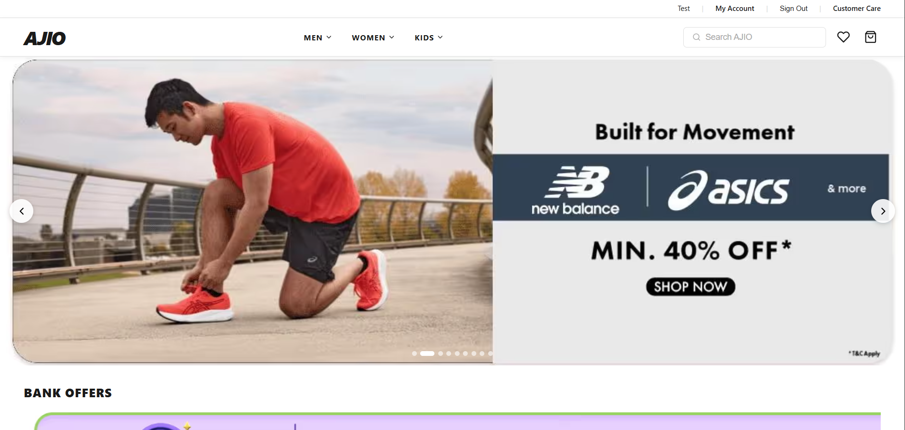
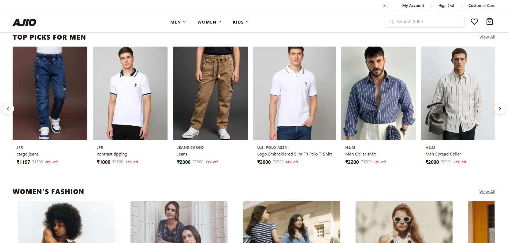
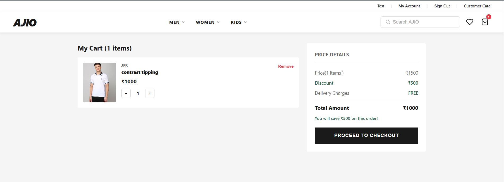
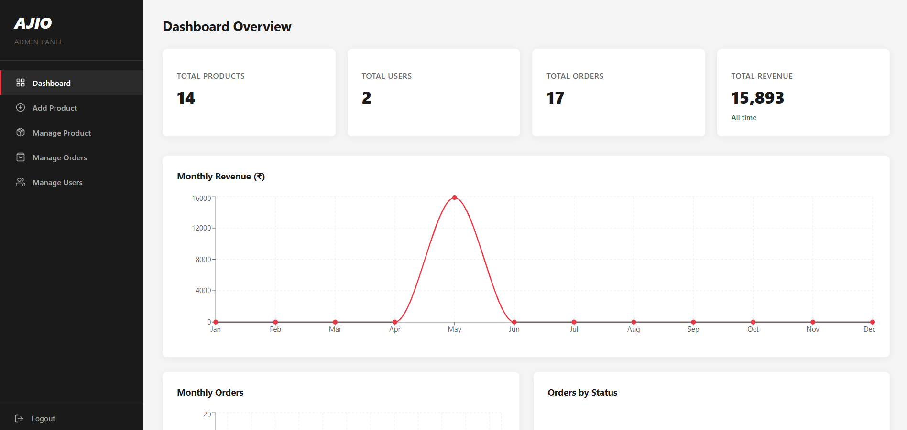

# AJIO Clone - Full Stack E-Commerce App

A full-stack e-commerce application built to replicate the core shopping experience of AJIO. The project covers the full flow of an online store, from browsing products to checkout, along with an admin panel to manage the store.

Live site: https://ajio-shop-frontend.onrender.com

Note: the site is hosted on a free server plan, so the first page load can take up to a minute if the server has been inactive.

## Features

- OTP based user authentication
- Product listing and management
- Cart and wishlist functionality
- Checkout with Cash on Delivery and Stripe payment options
- Automatic PDF invoice generation for orders
- Admin panel with order and sales charts
- Email notifications for order updates, sent through Resend

## Tech Stack

Frontend: React.js (Vite), React Router, CSS
Backend: Node.js, Express.js
Database: MongoDB Atlas
File Storage: Cloudinary
Payments: Stripe
Email: Resend API
Hosting: Render (frontend and backend)

## Project Structure

The project is split into two folders:

- `frontend` - the React application
- `server` - the Express backend and API routes

## Running the Project Locally

Clone the repository:
git clone https://github.com/Jebez-sharon/e-commerce-clone.git
cd e-commerce-clone

Install dependencies for both parts of the app:
cd frontend
npm install
cd ../server
npm install

Create a `.env` file inside the `server` folder with the following:
MONGO_URI=your_mongodb_connection_string
CLOUDINARY_API_KEY=your_cloudinary_key
STRIPE_SECRET_KEY=your_stripe_key
RESEND_API_KEY=your_resend_key

Start the backend:
cd server
npm run dev

Start the frontend in a separate terminal:
cd frontend
npm run dev

## Live Deployment

Frontend: https://ajio-shop-frontend.onrender.com
Backend API: https://ajio-clone-backend-qimi.onrender.com

## Author

Jebez Sharon
GitHub: https://github.com/Jebez-sharon

## Screenshots

### Home Page

### Product Page

### Cart

### Admin Dashboard

